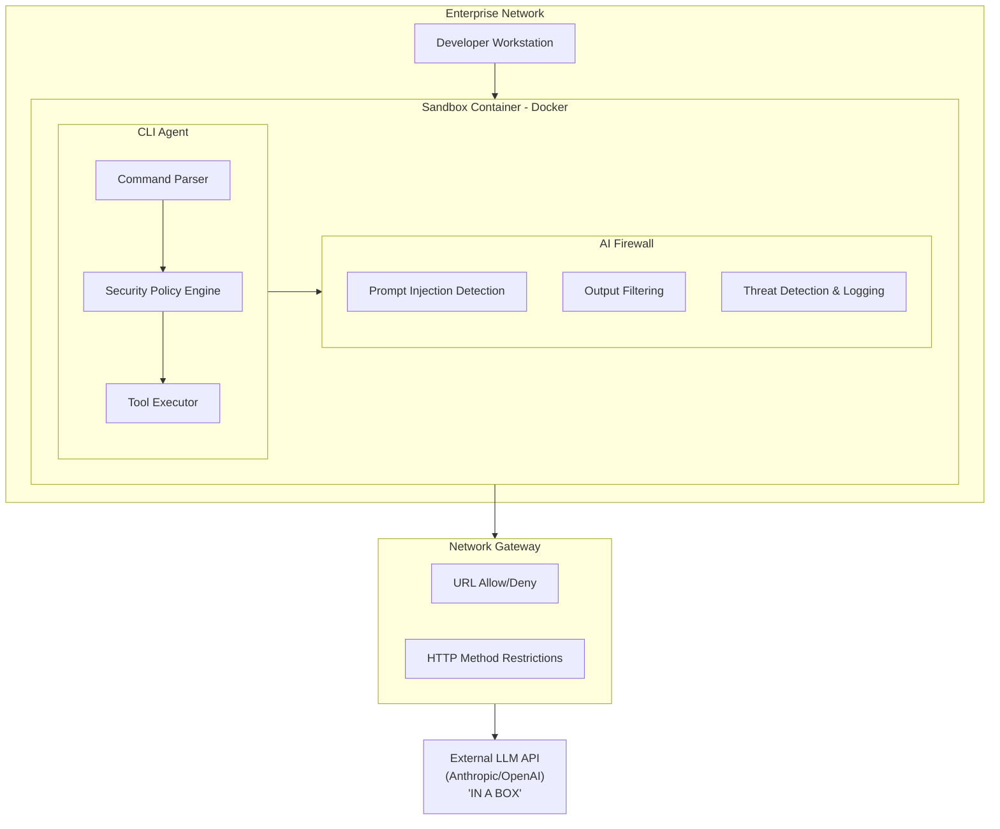
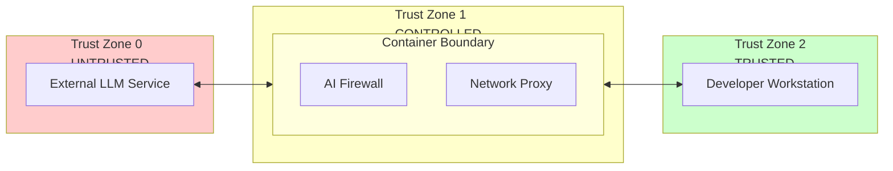
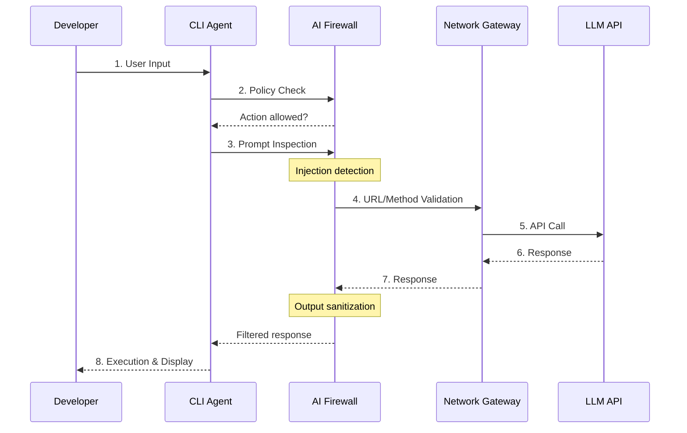
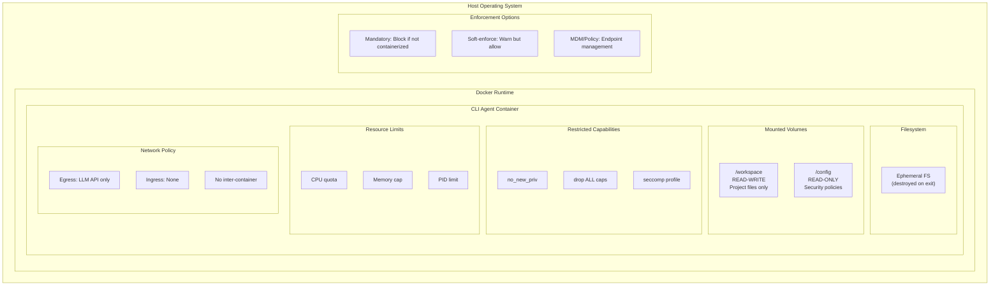
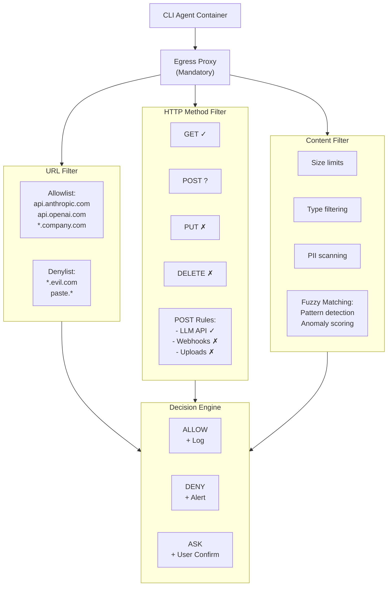
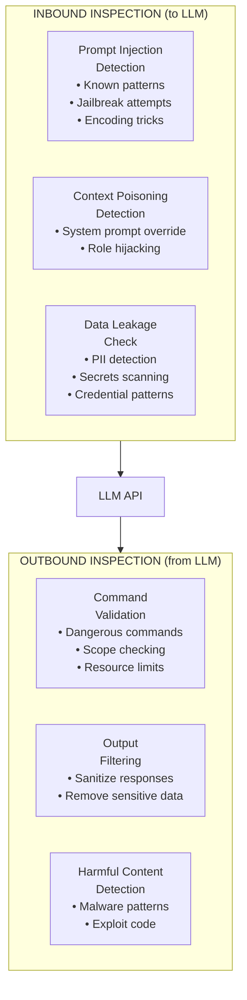
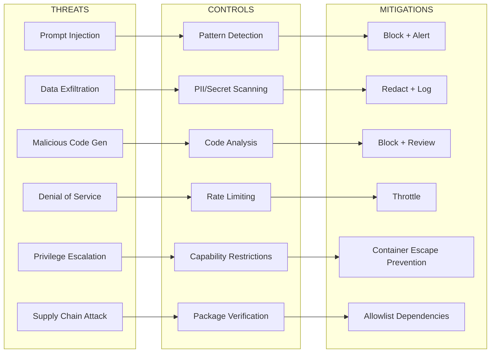
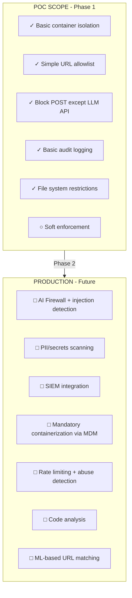

# Enterprise CLI Agent Architecture - Mermaid Diagrams

## 1. System Overview



## 2. Security Boundary / Trust Zones



## 3. Data Flow - Request/Response



## 4. Container Isolation Model



## 5. Network Control Architecture



## 6. AI Firewall Detail



## 7. Threat Matrix



## 8. POC vs Production Scope



## 9. Component Interaction Overview

```mermaid
C4Context
    title CLI Agent System Context

    Person(dev, "Developer", "Uses CLI agent for coding tasks")

    System_Boundary(container, "Sandbox Container") {
        System(cli, "CLI Agent", "Executes commands and tools")
        System(firewall, "AI Firewall", "Inspects and filters traffic")
    }

    System_Ext(llm, "LLM API", "External AI service")
    System_Ext(logging, "Audit Logging", "Centralized logs")

    Rel(dev, cli, "Commands")
    Rel(cli, firewall, "Requests")
    Rel(firewall, llm, "API calls")
    Rel(container, logging, "Audit events")
```

---

## Open Questions for InfoSec

| # | Question | Options | Recommendation |
|---|----------|---------|----------------|
| 1 | Should containerization be mandatory? | Mandatory / Soft-enforce / User choice | Mandatory for production |
| 2 | POST request handling? | Block all / Allow to LLM only / Allow with approval | Allow to LLM API only |
| 3 | Where to run AI Firewall? | In container / Separate service / Cloud proxy | Separate service for auditability |
| 4 | Fuzzy URL matching approach? | Strict allowlist / ML-based / Hybrid | Start with strict allowlist |
| 5 | Logging retention? | 30 days / 90 days / 1 year | Depends on compliance requirements |
| 6 | LLM provider? | Anthropic / OpenAI / Azure / Self-hosted | TBD based on data residency |
